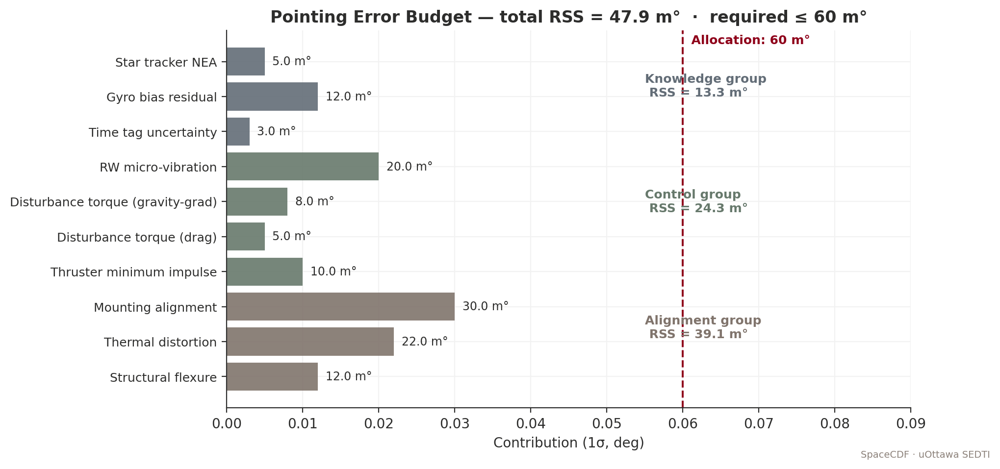

# Per-Role Background Briefings

This chapter is a per-role background briefing for first-time CubeSat
designers in a CDF. For each engineering position students might
take, it covers:

- **Decisions you own.** What you have to choose, in what order.
- **What you need to know first.** Inputs you cannot decide without.
- **Formulas, charts, and rules of thumb.** With references.
- **Common pitfalls.** What to watch for, especially first time.
- **References.** Live links to standards and texts.

The briefings are roughly 2–4 pages each. Each is self-contained;
read the one for your assigned role before Day 2 of Week 2 (CDF
intensive Day 1).

> **Expected reading.** Each role briefing is overnight reading the
> evening before students takes its CDF positions. Read your own
> briefing in full and scan one adjacent one (e.g. Power Engineers
> should scan Thermal; AOCS should scan Structures).

---

## Systems Engineer

You hold the budgets, the gate, and the authority to call a trade.

### Decisions you own

1. **Margin policy for this study.** You set the per-budget margin
   targets for the current phase per ECSS-M-ST-10C — typically
   Phase A: +44 % mass, +25 % power, 6 dB link, +25 % Δv;
   tightening to +5 % / +5 % / 3 dB / +10 % at Phase D.
2. **Budget closure decisions.** When power is over budget, you
   decide whether the team trades a payload duty cycle, a battery
   capacity, an SA area, or an end-of-life lifetime.
3. **Cross-domain conflict resolution.** When AOCS wants more
   reaction-wheel mass and Thermal wants the same area for a
   radiator, you convene the affected positions and arbitrate.
4. **Gate-review readiness.** You judge whether the team is
   ready to enter PDR, and you sign the action items off.

### What you need to know first

- **Mission objectives** (SE Process 1) — the *why* drives the
  budgets you're closing.
- **System-V model** and where each position sits on it (NASA SEH
  §2). See *Course Plan* Figure 2.2.
- **17 NASA SEH processes** — you'll touch most of them every day
  (NASA SEH §6).
- **The current ECSS phase the team is in** — which sets margin
  policy (ECSS-M-ST-10C §6).

### Formulas, charts, rules of thumb

ECSS margin policy by phase (mass example, all margins reduce
phase-by-phase):

| Phase | Mass | Power | Link | Δv |
|-------|-----:|------:|-----:|---:|
| A | +44 % | +25 % | 6 dB | +25 % |
| B | +24 % | +20 % | 4 dB | +15 % |
| C | +13 % | +10 % | 3 dB | +10 % |
| D | +5 %  | +5 %  | 3 dB | +5 %  |

*Figure SE.1 — Mass distribution and the ECSS margin schedule. Your
job is to keep total mass under the appropriate column for the
current phase.*

### Common pitfalls

> **Watch out.** Resolving conflicts by averaging the two domains'
> requests *without* re-baselining the affected requirements is the
> classic systems-engineering failure mode. Always update the
> requirement before accepting the trade.

> **Watch out.** Margin is not slack. Margin is uncertainty
> insurance. If you give the margin to anyone — to AOCS for an
> extra wheel, say — record it as a depletion of margin in the
> change log, not as a new allocation.

### References

- NASA SEH (SP-2016-6105 Rev 2) — [https://www.nasa.gov/reference/systems-engineering-handbook/](https://www.nasa.gov/reference/systems-engineering-handbook/)
- ECSS-M-ST-10C — [https://ecss.nl/](https://ecss.nl/)
- Wertz et al., *Space Mission Engineering: The New SMAD* (2011), Ch. 2.
- Larson & Wertz, *SMAD4*, Ch. 1, 22.

---

## Mission Analyst

You own the mission's relationship with physics: the orbit, the
ground track, the lighting conditions, the contact times.

### Decisions you own

1. **Orbit type and altitude.** LEO / SSO / MEO / GEO / HEO /
   lunar. Altitude to balance science return, lifetime, drag,
   radiation, and launch cost.
2. **Inclination.** Drives latitude coverage, ground-track repeat,
   and (with altitude) Sun-synchronous condition.
3. **LTAN / LTDN** for SSO missions — drives β-angle envelope and
   eclipse season.
4. **Ground-station network.** Where to downlink, latency,
   coverage gaps.
5. **Maneuver plan.** When to phase, how to maintain station, when
   to de-orbit.

### What you need to know first

- The mission's **science target** — sun-glint avoidance? polar
  coverage? continuous Earth observation?
- **Latitude band** of interest (e.g. polar Arctic monitoring
  forces an inclined or polar orbit).
- **Lifetime target** and the regulatory framework
  (FCC 5-year / IADC 25-year).
- **Launch availability** — a target launcher constrains both
  inclination and altitude.

### Formulas, charts, rules of thumb

**Kepler period for a circular orbit** (verified across known
orbits in Figure MA.1 below):

$$ T = 2\pi \sqrt{a^3 / \mu} $$

where μ_Earth = 398 600.4418 km³/s² and a = R_Earth + h.

*Figure MA.1 — Kepler's Third Law. Plotted markers (ISS-class,
Sentinel-2, GPS, GEO) sit on the analytical curve to better than
0.5 % — which is the expected agreement once Earth oblateness is
included separately.*

**Sun-synchronous condition** — pick i so that J₂-driven nodal
regression matches Earth's mean motion around the Sun (~0.9856
deg/day). At 600 km altitude, i ≈ 97.79°.

*Figure MA.2 — J₂ nodal regression rate vs inclination. The dashed
horizontal is the SSO target. The intersection with the 700-km
curve gives the SSO inclination at that altitude.*

**Eclipse fraction** for a circular orbit, valid for |β| < β\* =
arcsin(R/(R+h)):

$$ f_{eclipse} = \frac{1}{\pi} \arccos \left( \frac{\sqrt{h^2+2Rh}}{(R+h)\cos\beta} \right) $$

For β > β\*, the orbit is fully sunlit.

*Figure MA.3 — β-angle envelope over a year and eclipse fraction
analytical curves.*

**Orbital lifetime rule of thumb** (drag-dominated LEO):

$$ \tau_{years} \approx \frac{h - 200}{30} \cdot \frac{m/A}{50} $$

*Figure MA.4 — Orbital lifetime envelope vs altitude. Below ~600 km
a 6U CubeSat (m/A ~ 50 kg/m²) decays inside 25 years; below
~ 425 km it can decay inside 5 years (the FCC rule).*

### Common pitfalls

> **Common mistake.** Picking 500 km thinking it gives a 25-year
> lifetime — it doesn't, for a typical 6U. Always confirm against
> the rule-of-thumb chart and an STK or GMAT propagation.

> **Watch out.** Sun-glint angle for ocean-colour imaging changes
> with both season (β) and longitude. If your mission cares about
> sun-glint, build a year-long β/Sun-azimuth heatmap before
> committing to LTAN.

### References

- Curtis, *Orbital Mechanics for Engineering Students* (3rd ed.).
- Vallado, *Fundamentals of Astrodynamics and Applications* (4th ed.).
- SMAD4 Ch. 9 (orbit selection).
- Wertz, *Mission Geometry: Orbit and Constellation Design and Management* (2001).
- AGI STK — [https://www.agi.com/products/stk/](https://www.agi.com/products/stk/).
- NASA GMAT (open source) — [https://software.nasa.gov/software/GSC-17177-1](https://software.nasa.gov/software/GSC-17177-1).

---

## Payload Engineer

You own the science. The mission exists to do what your payload
does, and every other subsystem ultimately serves yours.

### Decisions you own

1. **Payload concept & sensor type.** Optical / SAR / hyperspectral
   / radiometer / RF receiver / etc.
2. **Aperture & spectral bands.** Drives resolution, SNR, mass.
3. **Operating concept.** Pushbroom vs whiskbroom vs framing,
   continuous vs target-cued.
4. **Data rate & data volume per orbit.** This drives Comms and
   OBDH.
5. **Calibration plan.** On-orbit sources, ground references,
   cadence.

### What you need to know first

- **Mission objective measurable** (MoP). For ocean colour you
  need certain bands at certain SNR; for SAR you need a certain
  ground-resolution and revisit; for AIS you need a certain
  detection probability.
- **Orbit altitude** — drives slant range, GSD, coverage.
- **Mass and power available** — typically 30–50 % of the platform.

### Formulas, charts, rules of thumb

**GSD diffraction limit** for an unobstructed aperture:

$$ \mathrm{GSD}_{diff} = \frac{1.22 \lambda h}{D} $$

**GSD pixel limit:**

$$ \mathrm{GSD}_{pix} = \frac{p \cdot h}{f} $$

where p is pixel pitch and f is focal length. The achievable GSD is
the larger of the two.

*Figure PL.1 — GSD vs aperture for visible imagers (λ = 550 nm).
The dashed line is the pixel-limit at 500 km for p = 6 µm and
f/D = 5.*

**SAR antenna minimum length:**

$$ L_{ant,min} = 2 \cdot \delta_{azimuth} $$

i.e. the antenna along-track length must exceed twice the desired
azimuth resolution.

### Common pitfalls

> **Common mistake.** Sizing the payload aperture for the
> diffraction limit while the detector pixels are too coarse to
> use it. Match the two — pixel-limited and diffraction-limited
> GSDs should be comparable.

> **Watch out.** Data volume per orbit grows with the aperture in
> two ways at once: more pixels, faster line rate. Check the daily
> download capacity (Figure PL.2) before committing.

*Figure PL.2 — Daily downlink capacity by band, against typical
payload data volumes. UHF closes for housekeeping only; S-band for
imaging; X-band for SAR / hyperspectral.*

### References

- SMAD4 Ch. 9 (payload).
- Cracknell, *Introduction to Remote Sensing* (3rd ed.).
- Rees, *Physical Principles of Remote Sensing* (3rd ed.).
- Cumming & Wong, *Digital Processing of Synthetic Aperture Radar Data*.
- ECSS-E-ST-10-04C — Space environment for payload sizing — [https://ecss.nl/](https://ecss.nl/).

---

## Power Engineer

You own the orbit-by-orbit energy balance.

### Decisions you own

1. **Solar-array architecture.** Body-mounted vs deployable;
   gimballed vs fixed; technology (triple-junction GaAs vs Si).
2. **Solar-array area** — at end-of-life, accounting for
   degradation, β-angle range, and pointing.
3. **Battery capacity and DoD.** Cycle life vs eclipse depth.
4. **Bus voltage and PCDU architecture.** Single-bus vs dual-bus;
   regulated vs unregulated; MPPT topology.
5. **Power-mode duty cycle.** Maps to ConOps.

### What you need to know first

- **Orbit** — drives β-angle envelope and eclipse fraction.
- **Orbit-average load** from all subsystems (Watts).
- **Mission lifetime** — drives cycle count and EOL degradation.

### Formulas, charts, rules of thumb

**Solar-array sizing (first cut):**

$$ A_{SA} = \frac{P_{avg} \cdot \left(1 + \frac{f_{eclipse}}{f_{sun}\,\eta_{dis}}\right)}{S_{0}\,\eta_{cell}\,\cos\beta\,(1-D_{deg})} $$

where S₀ = 1361 W/m², η_cell ≈ 0.30 for triple-junction GaAs,
D_deg ≈ 10 % for 5-year LEO end-of-life.

*Figure PW.1 — Solar-array nomograph at η = 30 %, 10 % EOL
degradation, β = 20°, η_dis = 85 %. A 6U at 15 W average needs
~870 cm² at end-of-life.*

**Battery sizing — usable energy:**

$$ E_{usable} = \mathrm{DoD} \cdot E_{nominal} \quad ; \quad E_{nominal} = \frac{P_{avg} \cdot t_{eclipse}}{\eta_{dis} \cdot \mathrm{DoD}} $$

*Figure PW.2 — Battery cycle life vs DoD for Li-ion families.
A 30 % DoD design point gives the cycles needed for a 5-year LEO
mission with margin. Heritage chemistry like LiCoO₂ requires
deeper de-rating; LFP gives more headroom but is less mass-dense.*

**Power profile across one orbit** — Figure PW.3 shows the typical
generation/load picture.

*Figure PW.3 — Generation (top) and stacked load profile (bottom)
across one orbit.*

### Common pitfalls

> **Watch out.** Sizing the array for begin-of-life will starve the
> battery at end-of-life. Always compute at EOL with realistic
> degradation (e.g. 10 % over 5 years for triple-junction GaAs in
> LEO).

> **Common mistake.** Forgetting that the array only generates
> when the cells see the Sun. β = 0° at season change means the
> array sees zero illumination at orbit noon — design for the
> worst case in the year.

### References

- ECSS-E-ST-20C — *Electrical and electronic* — [https://ecss.nl/](https://ecss.nl/)
- SMAD4 Ch. 11 (power).
- Patel, *Spacecraft Power Systems*.
- Brown, *Spacecraft Propulsion and Power Subsystems*.

---

## AOCS Engineer

You own the spacecraft's pointing.

### Decisions you own

1. **Pointing requirement** — knowledge vs control vs stability,
   per axis.
2. **Sensor suite** — Sun sensor / magnetometer / star tracker /
   GPS / IMU.
3. **Actuator suite** — magnetorquer / reaction wheel /
   monopropellant / cold-gas.
4. **Modes & transitions** — sun-acquisition, detumble, fine
   pointing, safe.
5. **Momentum management plan** — how often, with what.

### What you need to know first

- **Pointing requirement** from Payload (e.g. 0.05° 1σ for a
  pushbroom imager).
- **Disturbance environment** at the chosen orbit (drag at 400 km
  vs 700 km vs SSO).
- **Spacecraft inertia tensor** — Structures gives you this.

### Formulas, charts, rules of thumb

**Pointing budget — RSS contributors:**

$$ \sigma_{pointing}^2 = \sigma_{knowledge}^2 + \sigma_{control}^2 + \sigma_{alignment}^2 $$

*Figure AC.1 — Pointing-error budget tree. Knowledge, control, and
alignment groups RSS into the total. The dashed line is the mission
allocation.*

**Reaction-wheel sizing — momentum capacity:**

$$ H_{wheel} \geq T_{disturbance} \cdot t_{between\;desat} \cdot k_{margin} $$

*Figure AC.2 — Momentum accumulation per orbit (left) and
disturbance-torque order-of-magnitude (right). At 500 km, drag
typically dominates with ~1 µN·m, accumulating ~ 50–100 mN·m·s
over a few orbits.*

### Common pitfalls

> **Watch out.** Quaternion normalisation drift in flight software
> — even a 1e-6 drift per second adds up. Renormalise every cycle.

> **Common mistake.** Designing for fine pointing without sizing
> the wheel for desat unloading. Plan the desat strategy at the
> same time as the wheel.

### References

- ECSS-E-ST-60-20C — *AOCS — Part 1* — [https://ecss.nl/](https://ecss.nl/).
- Markley & Crassidis, *Fundamentals of Spacecraft Attitude Determination and Control*.
- Sidi, *Spacecraft Dynamics and Control*.
- SMAD4 Ch. 10.

---

## Thermal Engineer

You keep every component inside its operating range across the
hot, cold, and transient cases.

### Decisions you own

1. **Hot-case / cold-case envelope** — define them in terms of
   β-angle, season, eclipse, internal heating.
2. **Surface finishes (α, ε)** for each external panel and
   radiator.
3. **MLI vs heaters** — passive insulation vs active control.
4. **Heat-rejection topology** — radiator location and area.
5. **Thermal interfaces** — conductive paths to and from each
   component.

### What you need to know first

- **Operating temperature ranges** for every component (battery
  is the strictest, typically −5 to +25 °C charging).
- **Eclipse fraction & duration** from Mission Analyst.
- **Internal dissipation map** from Power.

### Formulas, charts, rules of thumb

**Radiative equilibrium for a flat plate:**

$$ T_{eq} = \left( \frac{\alpha_s S + \epsilon_{IR} \phi_{IR}}{\sigma\,\epsilon_{IR}} \right)^{1/4} $$

*Figure TH.1 — Equilibrium temperature vs α/ε for a flat plate at
LEO, with common surface finishes marked.*

### Common pitfalls

> **Common mistake.** Using α and ε at room temperature for IR
> calculations — at -100 °C, ε of many materials shifts. Cite the
> source data temperature.

> **Watch out.** MLI is rated by effective ε* not by base
> material. Use ε* ≈ 0.03 for 10-layer MLI; less for fewer layers.

### References

- ECSS-E-ST-31C — *Thermal control* — [https://ecss.nl/](https://ecss.nl/)
- Gilmore, *Spacecraft Thermal Control Handbook*, Vol. I & II.
- SMAD4 Ch. 12.
- ESATAN-TMS — [https://www.esatan-tms.com/](https://www.esatan-tms.com/).

---

## Structures Engineer

You make sure the spacecraft survives launch and on-orbit, and
that everyone else's hardware is mechanically interfaced.

### Decisions you own

1. **Primary structure topology** — monolithic, panel-and-rib,
   or 3D-printed.
2. **Material selection** — Al, Ti, CFRP, sandwich.
3. **Mass-budget closure with margin.**
4. **Launch-load verification path** — analysis (FEA), test, or
   both.
5. **Mechanical interfaces** — fastener pattern, deployer
   compatibility (ISIPOD / EXOpod / CSD).

### What you need to know first

- **Launcher environment** (qualification levels for sine,
  random vibration, shock).
- **Component mass and CG** — every subsystem provides this.
- **Cal Poly CDS Rev 14** envelope for CubeSats.

### Formulas, charts, rules of thumb

**Margin of safety:**

$$ \mathrm{MoS} = \frac{\sigma_{allow}}{\mathrm{FoS} \cdot \sigma_{applied}} - 1 $$

For Al 7075-T6 yield: σ_yield = 503 MPa, FoS_yield = 1.25.

**Modal analysis** — first mode > 100 Hz typical CubeSat
requirement.

### Common pitfalls

> **Watch out.** Forgetting fastener and adhesive mass — they
> typically add 5–10 % on top of the structural mass.

> **Common mistake.** Sizing for static loads and missing the
> dynamic amplification factor (random vibration). Apply
> Q-factor (typically 5–10) at resonance.

### References

- ECSS-E-ST-32C — *Structures* — [https://ecss.nl/](https://ecss.nl/).
- Sarafin, *Spacecraft Structures and Mechanisms*.
- Cal Poly CDS Rev 14 — [https://www.cubesat.org/cds-announcement](https://www.cubesat.org/cds-announcement).

---

## Propulsion Engineer

You own the Δv. (Even if your CubeSat has none, you decide that.)

### Decisions you own

1. **Need for propulsion** — drag make-up? deorbit? phasing?
   formation? rendezvous?
2. **Propellant choice** — cold gas / monoprop / bipropellant /
   electric (Hall, ion, PPT, FEEP).
3. **Thruster sizing** — thrust vs Isp vs power.
4. **Total propellant mass** — Tsiolkovsky.
5. **Plume impingement & contamination plan.**

### What you need to know first

- **Δv budget** — sum of all required maneuvers with margin.
- **Mission duration** — drives cumulative Δv for drag-dominated
  orbits.
- **Available power** — drives EP feasibility (a CubeSat at 20 W
  cannot run a 200 W Hall thruster).

### Formulas, charts, rules of thumb

**Tsiolkovsky:**

$$ \Delta v = I_{sp}\,g_0\,\ln\frac{m_0}{m_f} $$

*Figure PR.1 — Δv vs mass ratio at five characteristic Isp values.
Horizontal lines show typical mission Δv budgets.*

### Common pitfalls

> **Watch out.** Isp is a function of inlet conditions and nozzle
> expansion ratio. Quote the value at the operating point you'll
> actually fly.

> **Common mistake.** Confusing total mass (m₀) with dry mass
> (m_f) when applying Tsiolkovsky.

### References

- Sutton & Biblarz, *Rocket Propulsion Elements* (9th ed.).
- ECSS-E-ST-35C — *Propulsion general* — [https://ecss.nl/](https://ecss.nl/).
- Goebel & Katz, *Fundamentals of Electric Propulsion*.

---

## Communications Engineer

You move the bits — both ways.

### Decisions you own

1. **Frequency band** — UHF / S / X / Ka. Drives licensing,
   antenna size, FSPL.
2. **Modulation and coding.**
3. **Antenna pattern** — high-gain dish vs patch vs deployable.
4. **Ground-station network** — single GS vs network.
5. **Link margin allocation** at each phase.

### What you need to know first

- **Daily data volume** from Payload.
- **Latency requirement** — if any.
- **Pointing capability** from AOCS (drives antenna pattern
  needs).
- **Regulatory constraints** for the chosen band.

### Formulas, charts, rules of thumb

**Free-space path loss:**

$$ L_{FS} = 20 \log_{10}(4 \pi d / \lambda) \;\text{dB} $$

*Figure CO.1 — FSPL across bands. At 2.2 GHz (S-band) over a
1500 km slant, FSPL ≈ 163 dB; at 26 GHz (Ka-band), 184 dB.*

**Link budget closure:**

$$ \frac{C}{N_0} = \mathrm{EIRP} - L_{path} - L_{atm} - L_{point} + G/T - k\;[\mathrm{dB}\!\cdot\mathrm{Hz}] $$

with k = -228.6 dBW/(K·Hz).

*Figure CO.2 — A canonical S-band waterfall. Read it left-to-right:
gains add, losses subtract, the bottom-right is required C/N₀ and
margin.*

**Eb/N₀ → BER** — Figure CO.3 shows the standard curves.

*Figure CO.3 — Eb/N₀ vs BER for BPSK, QPSK, 8-PSK, FSK, and a
typical concatenated coding scheme.*

**Antenna patterns** — high-gain vs low-gain.

*Figure CO.4 — High-gain dish (33 dBi, narrow) vs S-band patch
(~6 dBi, wide). Dish needs accurate AOCS pointing; patch tolerates
~30° body rate.*

### Common pitfalls

> **Watch out.** Pointing loss is not negligible. For a 1° HPBW
> dish, a 0.3° pointing error costs ~1 dB; at 0.5° it costs ~3 dB.

> **Common mistake.** Forgetting Doppler. A 2.2 GHz S-band link
> from a 7.5 km/s LEO has ±55 kHz Doppler at horizon — your
> receiver tracking has to follow.

### References

- ECSS-E-ST-50-05C — RF & modulation — [https://ecss.nl/](https://ecss.nl/).
- Pratt, Bostian & Allnutt, *Satellite Communications* (3rd ed.).
- ITU-R Recommendations — [https://www.itu.int/en/ITU-R/](https://www.itu.int/en/ITU-R/).

---

## OBDH / Software Engineer

You own the flight computer, the flight software, the telemetry
list, and FDIR.

### Decisions you own

1. **OBC architecture** — single SBC or redundant pair; SoC vs
   discrete.
2. **Bus topology** — CAN / SpaceWire / I²C / SPI.
3. **Memory architecture** — RAM, flash, mass-memory, EDAC scheme.
4. **FSW architecture** — mode manager, ADCS control loop, TM/TC
   handler, FDIR rules.
5. **PUS service set** — which CCSDS PUS services to implement.

### What you need to know first

- **TM/TC volume** from each subsystem.
- **Real-time loop rates** required by AOCS.
- **Storage volume** for the longest no-contact gap (mass-memory
  sizing).

### Formulas, charts, rules of thumb

- **Mass memory sizing:** longest contact gap × peak data rate ×
  margin (1.5–2×).
- **Watchdog timer:** typical 30 s for CubeSat OBC; less for
  high-criticality FSW threads.
- **EDAC overhead:** Hamming SECDED ~ 12.5 % for 64-bit words.

### Common pitfalls

> **Watch out.** Telemetry list overruns are the #1 OBDH late
> defect. Lock the list at SRR; treat any addition as a
> change-control item.

### References

- CCSDS PUS — [https://public.ccsds.org/Pubs/660x0g3.pdf](https://public.ccsds.org/Pubs/660x0g3.pdf).
- ECSS-E-ST-40C — *Software* — [https://ecss.nl/](https://ecss.nl/).
- ECSS-Q-ST-80C — *Software product assurance* — [https://ecss.nl/](https://ecss.nl/).

---

## Operations Engineer

You'll fly the spacecraft after the team builds it. You also live
this on Day 3 of Week 3 in the simulation.

### Decisions you own

1. **Operations concept** — staffing, automation level, shift
   structure.
2. **Pass plan** — which procedures, in what order, every contact.
3. **Anomaly response tree** — who calls what, when.
4. **Telecommand / telemetry definition** — coordination with
   OBDH.

### What you need to know first

- **Mission ops modes** from ConOps.
- **Ground-station coverage** from Mission Analyst.
- **Procedure inventory** from the mission's procedure set
  (LEOP / commissioning / nominal / contingency / emergency).

### Common pitfalls

> **Watch out.** Voice-loop discipline is the silent killer.
> Cross-talk that sounds harmless in training breaks down under
> real-time pressure.

### References

- ECSS-E-ST-70C — *Ground systems and operations* — [https://ecss.nl/](https://ecss.nl/).
- ECSS-E-ST-70-32C — *Test and operations procedures*.
- NASA *Mission Operations Handbook* — [https://nodis3.gsfc.nasa.gov/](https://nodis3.gsfc.nasa.gov/).

---

## Ground Segment Engineer

You own the architecture between the antenna and the user.

### Decisions you own

1. **Ground-station network** — owned, leased, or commercial
   (Atlas, KSAT, Viasat, AWS Ground Station).
2. **MCS choice** — COSMOS / OpenMCT / Yamcs / commercial.
3. **Archive design** — L0 → L1 → L2 → distribution latency.
4. **Pass-planning tool**.
5. **Cyber-security architecture.**

### What you need to know first

- **Daily data volume** — drives bandwidth contracts.
- **Latency requirement** — drives station network density.
- **Mission classification** — defence missions need different
  architectures than civil.

### Common pitfalls

> **Watch out.** AWS Ground Station's pricing model can flip
> economics between band choices — do the math at the chosen
> data rate.

### References

- CCSDS Mission Operations standards — [https://public.ccsds.org/Pubs/](https://public.ccsds.org/Pubs/).
- KSAT — [https://www.ksat.no/](https://www.ksat.no/).
- AWS Ground Station — [https://aws.amazon.com/ground-station/](https://aws.amazon.com/ground-station/).

---

## Cost & Schedule

You're the team's reality check.

### Decisions you own

1. **WBS structure** (NPR 7120.5).
2. **Cost-estimating method** — parametric (SSCM, COMPACT),
   analogy, bottom-up.
3. **Schedule baseline** — milestones, critical path, float.
4. **Risk-adjusted estimates** — how to roll risk into both cost
   and schedule.

### Common pitfalls

> **Common mistake.** Treating the parametric tool's output as
> the answer. The output is a starting point; tailor it for your
> mission and the launch market you're working in.

### References

- NPR 7120.5F — [https://nodis3.gsfc.nasa.gov/](https://nodis3.gsfc.nasa.gov/).
- Wertz et al., SME, Ch. 23 (Cost).
- SMAD4 Ch. 20.
- AIAA Cost Modeling — [https://www.aiaa.org/](https://www.aiaa.org/).
